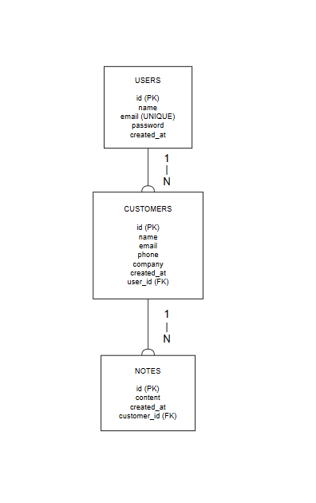
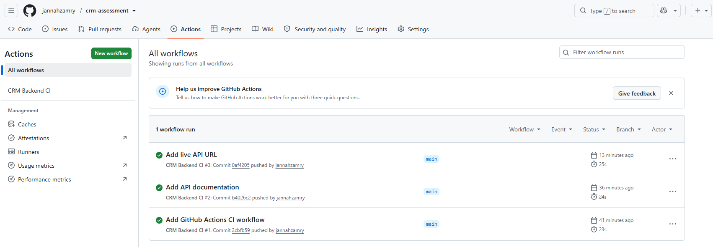
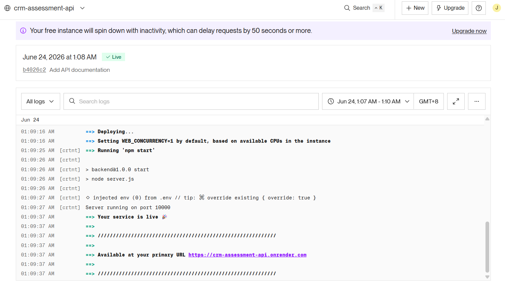
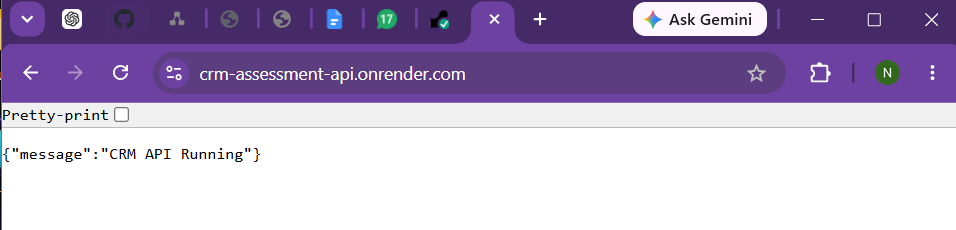

# CRM Assessment Project

A simple CRM system built with:

- Node.js
- Express.js
- PostgreSQL
- Prisma ORM
- JWT Authentication

---

# Features

## Authentication

- User Registration
- User Login
- JWT Authentication

## Customer Management

- Create Customer
- View Customers
- View Customer by ID
- Update Customer
- Delete Customer

## Notes Management

- Add Notes to Customer
- View Notes per Customer

---

# Database Design

## Tables

### Users

| Field      | Type            |
| ---------- | --------------- |
| id         | Integer         |
| name       | String          |
| email      | String (Unique) |
| password   | String          |
| created_at | Timestamp       |

### Customers

| Field      | Type        |
| ---------- | ----------- |
| id         | Integer     |
| name       | String      |
| email      | String      |
| phone      | String      |
| company    | String      |
| created_at | Timestamp   |
| user_id    | Foreign Key |

### Notes

| Field       | Type        |
| ----------- | ----------- |
| id          | Integer     |
| content     | String      |
| created_at  | Timestamp   |
| customer_id | Foreign Key |

---

# API Documentation

Base URL

http://localhost:5000

---

## Register User

POST /api/auth/register

Request

```json
{
  "name": "Nurul",
  "email": "nurul@example.com",
  "password": "123456"
}
```

---

## Login User

POST /api/auth/login

Request

```json
{
  "email": "nurul@example.com",
  "password": "123456"
}
```

---

## Create Customer

POST /api/customers

Headers

```text
Authorization: Bearer <token>
```

Request

```json
{
  "name": "ABC Trading",
  "email": "contact@abctrading.com",
  "phone": "0123456789",
  "company": "ABC Trading Sdn Bhd"
}
```

---

## Get Customers

GET /api/customers

---

## Get Customer By ID

GET /api/customers/:id

---

## Update Customer

PUT /api/customers/:id

---

## Delete Customer

DELETE /api/customers/:id

---

## Add Note

POST /api/notes/:customerId

Request

```json
{
  "content": "Customer interested in CRM package."
}
```

---

## View Notes

GET /api/notes/:customerId

---

# ER Diagram

USERS (1) ---- (N) CUSTOMERS

CUSTOMERS (1) ---- (N) NOTES

---

# Technologies Used

- Node.js
- Express.js
- PostgreSQL
- Prisma
- JWT
- Bcrypt

## API Endpoints

### Authentication

POST /api/auth/register
POST /api/auth/login

### Customers

GET /api/customers
GET /api/customers/:id
POST /api/customers
PUT /api/customers/:id
DELETE /api/customers/:id

### Notes

GET /api/notes/:customerId
POST /api/notes/:customerId

## Live API URL

https://crm-assessment-api.onrender.com/

## GitHub Repository

https://github.com/jannahzamry/crm-assessment

# CRM Assessment Project

## ER Diagram



## GitHub Actions CI



## Deployment



## API Testing


